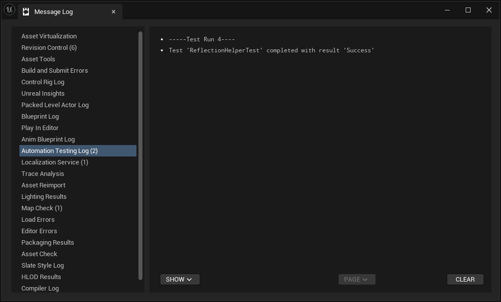

# 언리얼 엔진 Reflection과 FProperty 그리고 코드개선

이 리포지토리의 데모프로젝트는 본 문서 "`FProperty`와 `TFieldIterator`의 문제점 및 개선" 단락에 등장하는 코드개선 방법을 구현한 것으로 코드의 설명에 대해서는 해당 단락과 "`FReflectionHelper`의 구현" 단락을 참고 부탁드립니다.

## 개요 - Reflection을 사용한 클래스 멤버 접근

언리얼 엔진은 표준 C++ 위에 UHT (Unreal Header Tool)를 활용하여 C++ 표준이 제공하지 않는 런타임 Reflection 기능을 구현합니다. C++ 클래스 멤버를 언어 문법에 대한 정보로 런타임에 접근하는 것은 언리얼의 Reflection 시스템이 제공하는 유용한 기능 중 하나입니다. 즉 다음과 같은 것이 가능합니다.

```C++
class FRegularCPPClass
{
public:
    // 이 멤버에 접근하기 위해서는 컴파일 타임에 미리 지정해야 함
    // 예) 일반적인 접근, Pointer-to-Member를 통한 접근 등
    int32 IntMember;
};


USTRUCT()
struct FUnrealCPPStruct
{
    GENERATED_BODY()

public:
    // 이 멤버에는 int32라고 하는 타입, IntMember라고 하는 이름 등을 통해
    // 런타임에 접근하는 것이 가능
    UPROPERTY()
    int32 IntMember;
};


UCLASS()
class UUnrealCPPClass : public UObject
{
    GENERATED_BODY()

public:
    // 이 멤버에는 int32라고 하는 타입, IntMember라고 하는 이름 등을 통해
    // 런타임에 접근하는 것이 가능
    UPROPERTY()
    int32 IntMember;
};
```

C++ 표준은 C#, Java, Python 등과 같은 Managed 언어와 같이 상세한 런타임 Reflection을 제공하지 않기 때문에 한 번 컴파일이 완료되면 Type Erasure가 일어나 메모리 상에 존재하는 4바이트가 `int32`인지, `float`인지, `FRegularCPPClass`인지 알 수 없고, 자연스럽게 `FRegularCPPClass::IntMember`의 메모리 상 위치(오프셋; 이 경우 0바이트 위치)도 소실됩니다. 하지만 언리얼 엔진은 UHT라고 하는 Code Parser를 빌드 프로세스에 끼워넣어 클래스 멤버의 소스코드 상 이름, 클래스 멤버의 소스코드 상 타입과 같이 언어 문법과 관련된 정보를 추출해내 별도로 저장하여 런타임에 이 정보를 활용할 수 있게 합니다. 위 코드에서 `FUnrealCPPStruct`와 `UUnrealCPPClass`의 `IntMember`가 `UPROPERTY()` 매크로로 마킹되어 있는 것을 볼 수 있는데, 해당 매크로는 프로그램의 동작에 관해서는 아무 역할이 없으며(선언을 따라가보면 공백으로 전개되는 매크로임을 확인할 수 있습니다), 오직 UHT에게 정보를 추출해낼 코드의 위치를 알려주는 역할만을 가지고 있습니다. 

그리고 우리는 런타임에 다음과 같이 해당 멤버들에 접근하는 것이 가능합니다.

```C++
// 이러한 인스턴스가 있다고 가정
FUnrealCPPStruct Instance;

// UHT가 파싱한 클래스 정보 가져오기
UStruct* ClassInfo = FUnrealCPPStruct::StaticStruct();

// UHT가 파싱한 클래스 멤버 정보를 이름으로 가져오기
FProperty* IntMemberInfo = ClassInfo->FindPropertyByName(TEXT("IntMember"));

// 해당 정보를 통해 FUnrealCPPStruct::IntMember의 클래스 내 오프셋을 알아내 해당 멤버에 대한 포인터를 획득
int32* IntPtr = IntMemberInfo->ContainerPtrToValuePtr<int32>(&Instance);

// 멤버 접근
*IntPtr = 42;

// Instance의 IntMember의 값이 바뀌었음을 확인할 수 있음
UE_LOG(LogTemp, Warning, TEXT("%d"), Instance.IntMember);
```

`UUnrealCPPClass`에 대해서도 비슷한 방법을 적용할 수 있습니다.

언리얼 엔진은 이렇게 Reflection 정보를 생성한 클래스 멤버를 Property라는 이름으로 부르고 있습니다.

언리얼 엔진은 Property들을 Iterator를 사용하여 순회하는 방법도 제공합니다. 다음 코드는 위에서 선언한 `ClassInfo`와 `Instance`를 재사용해 `FUnrealCPPStruct`의 모든 `int32` Property들의 값을 42로 설정합니다.

```C++
for (TFieldIterator<FIntProperty> It{ ClassInfo }; It; ++It)
{
    int32* IntPtr = It->ContainerPtrToValuePtr<int32>(Instance);
    *IntPtr = 42;
}
```

이 코드에서 등장한 `FIntProperty`는 C++ 타입 `int32`에 대응되는 언리얼 엔진의 자료구조이며 `int32` 타입으로 선언된 클래스 멤버에 대한 Reflection 정보를 저장하는데 사용되므로 `TFieldIterator`를 사용해 모든 `int32` 클래스 멤버를 순회하기 위해서는 모든 `FIntProperty`를 순회하면 됩니다. 이에 대해서는 FProperty 구조 단락에서 좀 더 자세히 설명합니다.

## 런타임 Property 접근의 활용

Property 접근 기능을 사용하면 기존의 방식으로는 불가능했던 코드 단순화와 유지보수 비용의 절감이 가능합니다.

다음과 같은 사운드 클래스가 있다고 가정하겠습니다. (아래에서 사용된 클래스들은 실제로 존재하는 클래스들이 아니며 예시를 위해 창작되었습니다)

```C++
/**
 * 게임에서 재생되는 사운드들을 제어하는 클래스
 */
UCLASS()
class USoundControllerComponent : public UActorComponent
{
    GENERATED_BODY()

public:
    /**
     * 모든 사운드의 음소거를 설정/해제 합니다.
     */
    void MuteAll(bool bMute);

// ...
// ...
// ...

private:
    UPROPERTY()
    USoundPlayerComponent* LobbyBGMPlayer;

    UPROPERTY()
    USoundPlayerComponent* TownBGMPlayer;

    UPROPERTY()
    USoundPlayerComponent* DungeonBGMPlayer;

    UPROPERTY()
    USoundPlayerComponent* CharacterSoundPlayer;

    UPROPERTY()
    USoundPlayerComponent* MonsterSoundPlayer;
};
```

이 클래스는 게임에서 발생하는 사운드에 대해 유저가 설정을 조작할 수 있도록 하며 환경설정의 사운드 탭의 구현에 해당합니다. 여기서 `USoundControllerComponent::MuteAll`를 기존 방식(C++ 표준만을 사용한 방식)으로는 다음과 같이 구현할 수 밖에 없습니다.

```C++
void USoundControllerComponent::MuteAll(bool bMute)
{
    LobbyBGMPlayer->Mute(bMute);
    TownBGMPlayer->Mute(bMute);
    DungeonBGMPlayer->Mute(bMute);
    CharacterSoundPlayer->Mute(bMute);
    MonsterSoundPlayer->Mute(bMute);
}
```

이 방식의 명백한 문제점은 새로운 사운드 종류(새로운 `USoundPlayerComponent*` 멤버)가 추가될 때마다 추가한 프로그래머가 이 함수의 구현을 수정하는 것을 까먹으면 해당 사운드는 음소거 버튼으로 음소거 되지 않는다는 것입니다(특히 사운드의 경우 테스트의 자동화가 어려워 인간이 걸러낼 수 밖에 없는 영역이 있는데, 버그 다발 지역으로 지정이 되면 많은 인력이 낭비될 것입니다). 특히 이러한 클래스의 실제 구현에서는 이 함수 하나를 신경 쓰기만 하면 될 정도로 상황이 간단하지 않을 수 있습니다. 여러 멤버에 대해 일괄적으로 연산을 적용하는 코드가 필요한 곳은 전체 음소거 뿐만이 아니므로 멤버를 추가하고자 하는 프로그래머는 그러한 구현이 적용된 모든 코드를 찾아 수정 작업을 진행해야 합니다. 사운드 종류 하나를 추가하는 간단한 작업에 비해서 새 작업자가 들이는 유지보수 비용이 지나치게 거대하며 그 과정에서 휴먼 에러의 발생 가능성이 높고 단위 테스트 등 에러 발생에 대한 안전장치의 마련이 어렵기 때문에 버그의 라이브 배포로 이어집니다.

개요에서 설명한 방법을 사용하면 문제를 해결할 수 있습니다.

```C++
void USoundControllerComponent::MuteAll(bool bMute)
{
    for (TFieldIterator<FObjectProperty> It{ ThisClass::StaticClass() }; It; ++It)
    {
        if (It->PropertyClass == USoundPlayerComponent::StaticClass())
        {
            USoundPlayerComponent** ComponentPtr = It->ContainerPtrToValuePtr<USoundPlayerComponent*>(this);
            (*ComponentPtr)->Mute(bMute);
        }
    }
}
```

코드가 조금 복잡하지만(뒤따르는 단락에서 자세히 설명하고 개선합니다) 요점은 Reflection을 사용하면 각 멤버를 하나하나 나열하지 않아도 된다는 점에서 scalability가 생긴다는 것입니다. 이렇게 하면 새 작업자는 기존의 구현을 수정할 필요가 없습니다. 단순히 `UPROPERTY()`로 마크된 새 사운드 종류를 추가하기만 하면 기존에 구현되어 있는 기능에 새 사운드가 자동으로 편입됩니다. 이러한 구현 방식은 SOLID의 Open-Closed Principle을 준수합니다. 미래에 새 사운드를 추가할 수 있으며(기능의 확장에 대해 Open), 그러한 추가가 기존 구현의 수정을 요구하지 않기 때문입니다(구현의 수정에 대해 Closed).

이 아이디어를 확장하면 사운드를 카테고리화하고 카테고리 별 기능을 (유지보수 성이 좋게) 제공하는 것도 가능합니다. 각 사운드를 배경음악 카테고리와 사운드이펙트 카테고리로 분류하여 각각의 카테고리를 일괄적으로 음소거하는 기능을 구현하는 여러 방법 중 하나로 클래스 멤버의 이름을 사용하는 방법을 채택할 수 있습니다. 이를 위해서는 우선 클래스 멤버의 이름을 일정 형식으로 통일할 필요가 있습니다.

```C++
public:
// ...
// ...
// ...
    void MuteBGM(bool bMute);

private:
    UPROPERTY()
    USoundPlayerComponent* BGM_LobbyPlayer;

    UPROPERTY()
    USoundPlayerComponent* BGM_TownPlayer;

    UPROPERTY()
    USoundPlayerComponent* BGM_DungeonPlayer;

    UPROPERTY()
    USoundPlayerComponent* FX_CharacterPlayer;

    UPROPERTY()
    USoundPlayerComponent* FX_MonsterPlayer;
};
```

각 클래스 멤버의 이름에 해당 멤버가 속하는 카테고리에 따라 Prefix를 붙여주었습니다. `MuteBGM` 함수는 다음과 같이 구현할 수 있습니다.

```C++
void USoundControllerComponent::MuteBGM(bool bMute)
{
    for (TFieldIterator<FObjectProperty> It{ ThisClass::StaticClass() }; It; ++It)
    {
        if (It->PropertyClass == USoundPlayerComponent::StaticClass() && It->GetName().StartsWith(TEXT("BGM_")))
        {
            USoundPlayerComponent** ComponentPtr = It->ContainerPtrToValuePtr<USoundPlayerComponent*>(this);
            (*ComponentPtr)->Mute(bMute);
        }
    }
}
```

물론 이 방법이 카테고리화를 하는 유일한 방법은 아닙니다. 카테고리 별로 구조체를 선언하여 해당 구조체 안에 멤버들을 나열하고 구조체의 멤버를 순회하는 코드를 작성할 수도 있습니다. 이 경우 코드가 변수 이름에 종속적이지 않게 된다는 장점이 있습니다. 하지만 때로는 변수 이름에 종속되는 구현을 하는 것이 가장 효율적인 선택이 될 수도 있습니다. 인벤토리 클래스 안에 아이템 변수들이 존재하고 있고 기획에서 작성한 아이템 별 능력치를 클래스 안의 각 변수에 매핑하고 싶을 때와 같은 상황에서는 TMap을 선언해서 각 매핑을 일일이 적는 것보다는, 아이템의 이름과 변수의 이름이 이미 일치하고 있을 가능성이 높으니 아이템의 이름을 사용해 변수를 찾는 것이 효율적일 것입니다. 어느 경우에서건, 구현의 수정이 일어나지 않는다는 것은 큰 장점입니다.

## FProperty 구조

지금까지 언급하지 않은 `FProperty`의 상세에 대해 살펴보겠습니다. `FProperty`란 `UCLASS()` 또는 `USTRUCT()`로 선언된 클래스 및 구조체의 멤버 변수에 대해 `UPROPERTY()` 매크로를 지정하여 빌드 타임에 UHT가 생성한 메타데이터입니다. 이 메타데이터는 엔진이 시작하면서 메모리에 `FProperty`의 형태로 로드돼 게임 코드가 런타임에 접근할 수 있습니다. 클래스에 대한 메타데이터는 `UStruct` 클래스로 로드되는데, 이 클래스로부터 해당 클래스 내부의 각 Property에 대한 `FProperty`를 얻을 수 있으므로 접근 순서는 다음과 같습니다.

1. 클래스냐 구조체냐에 따라 적절한 방법으로 `UStruct*`를 가져옵니다.
    1. 구조체인 경우 `StructName::StaticStruct()` 스태틱 함수가 빌드 타임에 자동 생성되므로 이 함수를 호출하여 `UStruct*`를 얻습니다.
    1. 클래스인 경우 `ClassName::StaticClass()` 스태틱 함수가 빌드 타임에 자동 생성되므로 이 함수를 호출하여 `UStruct*`를 얻습니다. 단, 클래스의 경우 상속 관계에 있을 경우 베이스 클래스의 포인터를 통해 다형적으로 가장 Derived한 클래스의 `UStruct*`를 얻고 싶을 때는 `UObjectBase::GetClass`를 호출합니다.
1. `UStruct`의 멤버 함수를 호출하여 원하는 Property의 `FProperty*`를 얻습니다.
1. `FProperty*`로 원하는 연산을 실행합니다(멤버 접근 등).

클래스의 Property들의 `FProperty*`는 `UStruct`내에 연결 리스트의 형태로 저장되어 있습니다.

`FProperty`는 객체지향적인 구조를 채택하고 있기 때문에 각 C++ 타입에 해당되는 `FProperty`가 모두 별도의 클래스로 존재하며 `FProperty`를 베이스 클래스로 상속하고 있습니다. 예를 들어서 `int32`에 해당하는 `FProperty`의 구현은 `FIntProperty`이며 `int16`에 해당하는 구현은 `FInt16Property`, `FString`에 해당하는 구현은 `FStrProperty`입니다. 대응 관계의 일부를 표로 정리하면 다음과 같습니다.

|C++|FProperty|
|----------------|----------------|
|`int16`|`FInt16Property`|
|`int32`|`FIntProperty`|
|`int64`|`FInt64Property`|
|`float`|`FFloatProperty`|
|`bool`|`FBoolProperty`|
|`FString`|`FStrProperty`|
|`TArray<T>`|`FArrayProperty`|
|`TMap<T, U>`|`FMapProperty`|
|`TSoftObjectPtr<T>`|`FSoftObjectProperty`|
|`TSoftClassPtr<T>`|`FSoftClassProperty`|
|구조체|`FStructProperty`|
|클래스|`FObjectProperty`|

앞선 단락에서 `TFieldItertaor`를 활용해서 특정 C++ 타입의 `FProperty`들을 순회했었습니다(`FProperty`는 `FField`를 상속하기 때문에 이터레이터의 이름이 필드 이터레이터입니다). 기본적으로 `TFieldIterator`의 템플릿 파라미터로 원하는 C++ 타입에 해당하는 `FProperty` 클래스를 넘기면 해당 C++ 타입인 클래스 멤버들을 순회할 수 있는데, 위 테이블에서 `FString` 아래의 클래스 템플릿들 및 구조체/클래스들을 순회할 때는 원하는 타입만 정확하게 순회할 수 있도록 변별할 필요가 있습니다. `FArrayProperty`를 예로 들면 `FArrayProperty`는 `TArray<T>`의 T와 관계 없이 모든 `TArray`의 instantiation에 대응하는 `FProperty`입니다. 좀더 나아가 `FStructProperty`는 특정 `struct`과는 관계 없이 `USTRUCT()`로 마킹된 모든 `struct` property에 대응되는 `FProperty`입니다. 따라서 `TFieldIterator<FStructProperty>`와 같이 이터레이터를 사용하는 경우, 특정 `struct` 뿐만이 아닌 모든 `struct`를 가리지 않고 순회하게 됩니다.

때문에 특정 instantiation, 구조체 또는 클래스에 접근하고 싶은 경우에는 해당 `FProperty`의 구현을 살펴야 합니다. 각 구현에 따른 변별 방법을 정리하면 다음과 같습니다.

|C++|FProperty|변별법|
|----------------|----------------|----------------|
|`TArray<T>`|`FArrayProperty`|`FArrayProperty::Inner`의 타입을 확인했을 때 C++ `T` 타입에 해당하는 `FProperty`이면 `TArray<T>`에 해당하는 `FArrayProperty`임|
|`TMap<T, U>`|`FMapProperty`| `FMapProperty::KeyProp`과 `FMapProperty::ValueProp`의 타입을 확인했을 때 각각 C++ `T`와 `U` 타입에 해당하는 `FProperty`면 `TMap<T, U>`에 해당하는 `FMapProperty`임
|`TSoftObjectPtr<T>`|`FSoftObjectProperty`|비슷하게 `FSoftObjectProperty::PropertyClass`의 타입을 확인|
|`TSoftClassPtr<T>`|`FSoftClassProperty`|비슷하게 `FSoftClassProperty::MetaClass`의 타입을 확인|
|구조체|`FStructProperty`|`FStructProperty::Struct`가 원하는 구조체의 `UStruct*`와 동일한지 검사|
|클래스|`FObjectProperty`|`FObjectProperty::PropertyClass`가 원하는 클래스의 `UStruct*`와 동일한지 검사|

변별법에서 확인하는 `F...Property`의 멤버는 모두 `FProperty*` 타입의 멤버입니다. 즉 `FArrayProperty::Inner`가 `FIntProperty`를 가리키는 포인터인지 알아내기 위해서는 `CastField<FIntProperty>(Inner)`가 non-null을 반환하는지 체크할 필요가 있습니다. `TArray<int32>`에 대해 생성된 `FArrayProperty`라면 Cast가 성공하겠지만 `TArray<float>`에 대해 생성된 `FArrayProperty`라면 실패할 것입니다.

앞서 등장했던 `USoundControllerComponent::MuteAll` 함수의 구현을 다시 가져와 예시로 보여드리면 다음과 같습니다.

```C++
void USoundControllerComponent::MuteAll(bool bMute)
{
    // 1. USoundPlayerComponent는 UObject를 상속하는 UCLASS이기 때문에 FObjectProperty를 템플릿 파라미터로 지정합니다.
    // 2. USoundControllerComponent의 멤버들을 순회하고 싶기 때문에 ThisClass::StaticClass()가 반환하는 UStruct*를 생성자에 넘깁니다.
    for (TFieldIterator<FObjectProperty> It{ ThisClass::StaticClass() }; It; ++It)
    {
        // 3. 우리는 USoundPlayerComponent*의 순회를 원하므로
        // PropertyClass (UStruct*)가 USoundPlayerComponent의 UStruct*와 일치하는지 검사합니다.
        if (It->PropertyClass == USoundPlayerComponent::StaticClass())
        {
            // 4. 멤버에 대한 포인터를 획득합니다.
            // 검사를 통해 이 포인터가 USoundPlayerComponent*라는 것을 알아 냈기 때문에
            // 해당 void*를 USoundPlayerComponent*로 static_cast하는 것은 합당합니다.
            USoundPlayerComponent** ComponentPtr = It->ContainerPtrToValuePtr<USoundPlayerComponent*>(this);

            // 5. 이중포인터이므로 Dereference하여 함수를 호출합니다.
            (*ComponentPtr)->Mute(bMute);
        }
    }
}
```

## `FProperty`와 `TFieldIterator`의 문제점과 개선방법

위에서 설명했듯 언리얼 엔진 Reflection 시스템의 일부인 `FProperty`와 `TFieldIterator`를 사용하면 수정에 닫혀있고 확장에는 열려있는, 유지보수 비용이 낮은 코드를 작성하는 것이 가능합니다. 하지만 이러한 `FProperty`와 `TFieldIterator`에도 몇 가지 문제점이 존재합니다.

### `FProperty`의 Documentation 부재에 따른 코드 분석 비용

언리얼 엔진의 많은 부분이 그러하듯 `FProperty`에 대한 Documentation은 절망적으로 부족합니다. 때문에 `FProperty`에 대해 친숙하지 않은 사람이 Reflection을 사용하기 위해서는 우선 많은 조사를 선행할 필요가 있습니다. 먼저 `FProperty`라는 것이 존재한다는 것을 깨닫는 것부터 시작해서 `FProperty`가 어떻게 생성되는지, 어떠한 정보를 담고 있는지, 구조는 어떻게 되는지를 이해할 필요가 있으며 각 C++ 타입에 해당하는 `FProperty`의 구현은 어떤 것인지 파악해야 합니다. 마지막 내용을 파악하는 것은 의외로 쉽지 않은데 IDE 상에서 검색이 잘 되지 않기 때문입니다. `FIntProperty`를 예로 들면 `FProperty`를 바로 상속하는 것이 아니라 `TProperty_Numeric<int32>`를 상속하며, `TProperty_Numeric`은 `TProperty_WithEqualityAndSerializer`를 상속하고 `TProperty_WithEqualityAndSerializer`는 `TProperty`를 상속하는 등 상속관계가 꽤 복잡하고 이 상속 과정에서 Template Mix-in 패턴과 CRTP (Curiously Recurring Template Pattern) 가 사용되어 다중 상속이 중간에 섞이기 때문에 IDE가 상속 관계를 감지해주지 않습니다. 그리고 이러한 테크닉에 대해 미리 알고 있는 것이 아니면 `FIntProperty`가 최종적으로 `FProperty`를 상속한다는 사실을 알기 어렵습니다. 또한 `UObject*`가 아님에도 `FProperty*`를 `FIntProperty*` 등으로 `FField`의 `dynamic_cast`에 해당하는 `CastField`를 하는 것이 가능한 이유는 `FField`가 `enum`을 사용해 각 클래스 관계를 따로 정리해두었기 때문이라던지(언리얼 엔진은 RTTI를 기본으로 꺼두기 때문에 `dynamic_cast`가 작동하지 않음), 멤버에 접근하는 함수가 `FProperty::ContainerPtrToValuePtr`라던지, 위의 예시에서와 같이 그저 클래스의 멤버에 접근한다는 구현 내용에 비해 지나치게 많은 코드 분석 비용이 발생한다는 단점이 있습니다.

### 실수하기 쉬운 인터페이스

`FProperty`와 `TFieldIterator`는 프로그래머에게 너무 많은 것을 기억하고 "올바르게" 할 것을 요구합니다.

위에서 사용했던 예시를 다시 한 번 살펴보면 다음과 같습니다.


```C++
void USoundControllerComponent::MuteAll(bool bMute)
{
    // 1, 2
    for (TFieldIterator<FObjectProperty> It{ ThisClass::StaticClass() }; It; ++It)
    {
        // 3
        if (It->PropertyClass == USoundPlayerComponent::StaticClass())
        {
            // 4, 5
            USoundPlayerComponent** ComponentPtr = It->ContainerPtrToValuePtr<USoundPlayerComponent*>(this);
            (*ComponentPtr)->Mute(bMute);
        }
    }
}
```

1. 지정할 `FProperty`의 선택을 위해 앞선 단락의 테이블을 참조합니다. `USoundPlayerComponent*`를 순회하고 싶기 때문에 `FObjectProperty`를 지정합니다.
1. `USoundControllerComponent`의 멤버를 순회하고 싶기 때문에 `USoundControllerCompoent::StaticClass()`를 지정합니다. 구조체가 아닌 클래스이기 때문에 `StaticStruct()`와 혼동하지 않도록 주의합니다.
1. 모든 `UObject*` 멤버 중 `USoundPlayerComponent*`만 순회하고 싶기 때문에 앞선 단락의 테이블에서 `FObjectProperty`를 찾아 변별법을 조사합니다. 그리고 `PropertyClass`와 `USoundPlayerComponent::StaticClass()`를 비교합니다.
1. 멤버를 순회하고자 하는 인스턴스는 `USoundControllerComponent` 타입인 `this`이기 떄문에 인자로 넘깁니다.
1. `if`문 검사를 통해 이 Property의 타입이 `USoundPlayerComponent*`임을 알아냈으므로 `void*`를 `static_cast`합니다.

이 다섯 단계의 문제점은 코드 분석이 선행되어야 된다는 점도 있지만 무엇보다 사전에 이미 결정이 되어 있음에도 불구하고 프로그래머가 실수 없이 5단계를 모두 이행해야 한다는 점입니다. 좀 더 자세히 설명하면, `this`의 멤버 중 `USoundControllerComponent*`만 모두 순회하고 싶다고 결정한 순간 동시에 위의 다섯 가지 절차 또한 결정됩니다. 즉 실질적인 파라미터는 `this`와 `USoundControllerComponent*` 두 가지이지만 `FProperty`와 `TFieldIterator`는 이 이상의 정보를 실수 없이 기계적으로 나열할 것을 요구하고 있고, 이것의 실패는 버그로 이어집니다. 이러한 "불필요한 정보의 나열"은 해당 코드의 API 내지는 인터페이스가 잘못 설계되어 있음을 의미합니다.

### `FProperty`와 `TFieldIterator`의 개선

`FProperty`와 `TFieldIterator`의 문제점에 대해 알아보았으므로 이것을 개선하는 코드를 작성해보고자 합니다. 앞서 예시 코드에 대한 실질적인 파라미터가 `this`와 `USoundControllerComponent*` 두 가지임을 언급했었는데, 이것을 그대로 코드로 옮기기만 하면 문제가 쉽게 해결됩니다.

```C++
void USoundControllerComponent::MuteAll(bool bMute)
{
    FReflectionHelper::ForEachMember(this, [&](USoundControllerComponent* Each)
    {
        Each->Mute(bMute);
    });
}
```

`FProperty`와 `TFieldIterator`를 감싸는 클래스인 `FReflectionHelper`를 구현해 `this`의 멤버 중 `USoundControolerComponent*` 타입인 멤버들을 순회하며 `Mute`를 호출하는 코드입니다. 이 코드의 장점은 다음과 같습니다.

1. 간결한 코드 : 4줄 밖에 차지하지 않습니다.
1. 꼭 필요한 것만 파라미터로 지정 : `this`와 `USoundControllerComponent*`만 지정하면 순회할 수 있어 그 어떤 절차도 기억할 필요가 없습니다.
1. STL과 유사한 문법 사용 : STL의 특정 함수들과 같이 Functor를 파라미터로 받아 연산을 실행합니다.
1. 실수할 수 없음 : 불필요한 정보를 잘못 나열하는 등의 실수 가능성이 존재하지 않습니다.
1. `FProperty`에 대해 전혀 알지 못해도 됨(!) : `FProperty`, `TFieldIterator` 두 개념 및 언리얼 엔진의 Reflection과 관련된 전반적인 사항들이 모두 클래스 내부에 감춰져 있기 때문에 그 어떤 코드분석 비용도 발생하지 않습니다. 오늘 언리얼 엔진을 시작한 신입 프로그래머도 사용할 수 있습니다.

## `FReflectionHelper`의 구현

`FReflectionHelper`는 본 리포지토리의 `ReflectionHelper.h`에 구현되어 있습니다.

`FReflectionHelper`는 `FProperty`의 단점으로 지목했던 "불필요한 정보의 나열"을 C++ 문법을 사용해 자동화 하는 것을 목표로 합니다.

### C++ 타입으로 FProperty 타입 가져오기

`FReflectionHelper`의 구현에 앞서 구현에 필요한 두 가지 도구를 구현합니다. 먼저 필요한 것은 C++ 타입으로 해당 C++ 타입에 해당하는 `FProperty`의 구현 타입을 가져오는 것입니다. 이는 "`FProperty` 구조" 단락의 첫 번째 테이블의 자동화에 해당합니다. 일부를 여기에 다시 적으면 다음과 같습니다.

|C++|FProperty|
|----------------|----------------|
|`int32`|`FIntProperty`|
|`TArray<T>`|`FArrayProperty`|
|구조체|`FStructProperty`|
|클래스|`FObjectProperty`|

이것은 C++ 타입을 파라미터로 `FProperty` 타입을 반환하는 Type Function의 일종입니다. 그러므로 Class Template Specialization을 사용해 간단하게 매핑할 수 있습니다.

```C++
template <typename CPPType>
struct TGetFPropertyTypeFromCPPType;

template <>
struct TGetFPropertyTypeFromCPPType<int32>
{
    using Type = FIntProperty;
};

template <typename ElementType>
struct TGetFPropertyTypeFromCPPType<TArray<ElementType>>
{
    using Type = FArrayProperty;
};
```

Primary Template은 Definition을 생략해 지원하지 않는 C++ 타입을 인자로 넘길 때 컴파일이 되지 않게 합니다.

구조체와 클래스의 경우, specialization의 resolution에 있어서 구조체와 클래스가 아닌 경우에 선택되지 않게 방어할 필요가 있습니다. 전통적으로는 `std::enable_if`를 사용하거나, SFINAE 원칙을 활용해 invalid expression을 임의로 집어 넣는 것으로 candidate에서 제거할 수 있지만 C++20부터는 concept를 활용해 간단하게 구현할 수 있습니다.

```C++
template <typename MaybeUStructType>
concept CUStruct = requires { MaybeUStructType::StaticStruct(); };

template <typename MaybeUObjectType>
concept CUObject = std::is_base_of_v<UObject, MaybeUObjectType>;

template <typename MaybeContainerType>
concept CReflectedContainer = CUStruct<MaybeContainerType> || CUObject<MaybeContainerType>;
```

`USTRUCT()`로 마킹된 구조체는 UHT가 해당 구조체의 scope에 스태틱 멤버 함수로 `StaticStruct`를 생성합니다. 따라서 `StructName::StaticStruct()`의 호출이 올바른지 language correctness를 체크하는 것으로 `USTRUCT` 여부를 판단할 수 있습니다. `UCLASS()`는 항상 `UObject`를 상속하므로(상속하지 않으면 UHT가 빌드타임에 걸러내므로) 상속 여부만 확인하면 됩니다.

이것으로 `TGetFPropertyTypeFromCPPType`의 구조체와 클래스 Specialization을 구현할 수 있습니다.

```C++
template <CUStruct StructType>
struct TGetFPropertyTypeFromCPPType<StructType>
{
    using Type = FStructProperty;
};

template <CUObject UObjectType>
struct TGetFPropertyTypeFromCPPType<UObjectType*>
{
    using Type = FObjectProperty;
};
```

### FProperty 변별 자동화

Class Template의 instantiation이나 구조체 및 클레스는 여러가지 타입에 대해 하나의 `FProperty`가 일괄적으로 대응되기 때문에 원하는 타입과 정확하게 매치되는 `FProperty`인지 판별하려면 해당 `FProperty`의 구현을 살펴야합니다. 이는 "`FProperty` 구조" 단락의 두 번째 테이블의 자동화에 해당합니다. 일부를 여기에 다시 적으면 다음과 같습니다.

|C++|FProperty|변별법|
|----------------|----------------|----------------|
|`TMap<T, U>`|`FMapProperty`| `FMapProperty::KeyProp`과 `FMapProperty::ValueProp`의 타입을 확인했을 때 각각 C++ `T`와 `U` 타입에 해당하는 `FProperty`면 `TMap<T, U>`에 해당하는 `FMapProperty`임
|구조체|`FStructProperty`|`FStructProperty::Struct`가 원하는 구조체의 `UStruct*`와 동일한지 검사|

자동화에 필요한 함수는 다음과 같은 입력과 출력을 가집니다.

1. 입력 - 순회를 원하는 C++ 타입
1. 입력 - 여러 C++ 타입에 매칭되는 `FProperty`
1. 입력 - 해당 `FProperty`의 인스턴스
1. 출력 - 두 입력이 정확하게 매치하는 타입인지 여부

즉 다음과 같은 의사코드와 같은 사용법을 지닌 함수이어야 합니다.

```C++
FIntProperty Property; // 이런게 있다고 가정

check(TIsPropertyExactMatch<int32>::Check(&Property) == true);
```

```C++
FArrayProperty Property; // 이런게 있다고 가정
Property.Inner = new IntProperty; // 약 이렇다고 가정

check(TIsPropertyExactMatch<TArray<int32>>::Check(&Property) == true);
check(TIsPropertyExactMatch<TArray<float>>::Check(&Property) == false);
```

`FIntProperty`는 항상 `int32`에 대응되는 `FProperty`이므로 항상 참을 반환해야 합니다.

`FArrayProperty`는 `TArray`에 대응되지만 `TArray<int32>`에 대응될 때는 `FArrayProperty::Inner`가 `FIntProperty`일 때 뿐입니다.

2번 입력은 3번 입력으로 Deduce할 수 있기 때문에 템플릿 파라미터로 명시할 필요가 없습니다.

Primary Template을 구현하면 다음과 같습니다.

```C++
template <typename TargetCPPType>
struct TIsPropertyExactMatch
{
    template <typename PropertyType>
    static bool Check(PropertyType* Property)
    {
        static_assert(std::is_same_v<typename TGetFPropertyTypeFromCPPType<TargetCPPType>::Type, PropertyType>);
        return true;
    }
};
```

1대1 대응 관계에 있는 C++ 타입과 `FProperty` 페어를 처리하는 구현부입니다. `static_assert`를 사용해 `Check`의 파라미터로 `FProperty`의 베이스 클래스가 아닌 구체적 구현이 들어옴을 체크합니다. 1대1 대응은 언제나 정확한 매치임으로 항상 `true`를 반환합니다.

```C++
template <typename KeyType, typename ValueType>
struct TIsPropertyExactMatch<TMap<KeyType, ValueType>>
{
    static bool Check(FMapProperty* Property)
    {
        using KeyFPropertyType = typename TGetFPropertyTypeFromCPPType<KeyType>::Type;
        using ValueFPropertyType = typename TGetFPropertyTypeFromCPPType<ValueType>::Type;

        KeyFPropertyType* KeyProperty = CastField<KeyFPropertyType>(Property->KeyProp);
        ValueFPropertyType* ValueProperty = CastField<ValueFPropertyType>(Property->ValueProp);

        return KeyProperty
            && ValueProperty
            && TIsPropertyExactMatch<KeyType>::Check(KeyProperty)
            && TIsPropertyExactMatch<ValueType>::Check(ValueProperty);
    }
};
```

`TMap`을 처리하는 구현입니다. 구현은 큰 어려움 없이 단순합니다. `TMap<int32, float>`에 대해 체크한다고 가정했을 때, 이 C++ 타입에 정확하게 대응하는 `FMapProperty`는 `FMapProperty::KeyProp`가 `FIntProperty`이고 `FMapProperty::ValueProp`가 `FFloatProperty`인 `FMapProperty`입니다. 즉 해당 멤버들이 각각의 타입으로 `CastField`가 성공하는지 체크하면 됩니다. 위 코드에서는 캐스트 성공 여부의 체크 외에도 다시 한 번 `TIsPropertyExactMatch`를 호출하는데, `TMap<FMyStruct, int32>`처럼 `TMap`이 복합적인 경우를 대비한 것입니다. `FMyStruct`과 `FStructProperty`가 완전히 일치하는지를 추가적으로 검사할 필요가 있기 때문에 재귀적인 방법을 사용합니다. Leaf Case는 1대1 대응인 경우, 즉 항상 `true`입니다.

### 최종 구현

다음은 `TFieldIterationHelper::ForEachExactMatchProperty`의 구현입니다.

```C++
private:
    using TargetFPropertyType = typename TGetFPropertyTypeFromCPPType<TargetCPPType>::Type;

    template <typename ContainerType, typename FuncType>
    static void ForEachExactMatchProperty(ContainerType& DerefedContainer, FuncType&& Func)
    {
        for (TFieldIterator<TargetFPropertyType> It{ GetUStructOf(DerefedContainer) }; It; ++It)
        {
            if (TIsPropertyExactMatch<TargetCPPType>::Check(*It))
            {
                Func(*It);
            }
        }
    }
```

지금까지 구현한 두 가지 도구를 사용해 `TFieldIterator`에 적절한 파라미터를 제공, 정확히 매치되는 각 Property를 순회하는 모습입니다. 이곳이 가장 핵심적인 부분으로, 나머지 코드는 `FReflectionHelper`의 사용성이 깔끔하도록 뒷처리를 하는 코드로 이루어져 있습니다. 자세히는 `ReflectionHelper.h` 파일을 참고 부탁드립니다.

### 단위 테스트

이 코드가 잘 작동하는지 어떻게 확신할 수 있는가 - 단위 테스트가 작성되어 있기 때문입니다. 리포지토리의 `ReflectionHelperTest.cpp` 파일을 참고 부탁드립니다.

```C++
TArray<float> Collected;

FReflectionHelper::ForEachMember(Target, [&](UReflectionHelperTestObject* Each)
{
    Collected.Add(Each->FloatMember);
});

TestEqual(TEXT("새 방식으로 Reflection 테스트"), Collected[0], 100.f);
TestEqual(TEXT("새 방식으로 Reflection 테스트"), Collected[1], 200.f);
TestEqual(TEXT("새 방식으로 Reflection 테스트"), Collected[2], 300.f);
TestEqual(TEXT("새 방식으로 Reflection 테스트"), Collected.Num(), 3);
```



## 결론

언리얼 엔진의 Reflection 시스템은 C++와 같은 네이티브 언어에는 부족한 런타임 메타 프로그래밍 기능을 보완하지만 그 사용법이 실제의 활용에서는 다소 어려움을 유발합니다. 다만 그 이유에 대한 적절한 분석을 통해 해결방안을 도입함으로써 한 층 더 활용성이 좋은 시스템으로 발전시키는 것이 가능했습니다. 활용성이 좋은 Reflection 시스템은 간결하면서도 유지보수성이 좋은 코드를 작성하는데 도움이 되기 때문에 프로젝트의 생산성 및 안정성 향상으로 이어질 수 있습니다.
